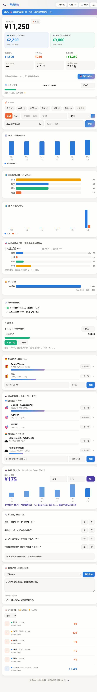

# 一账清欢 💰 · Yizhangqinghuan — Personal Finance Manager

> 一个会管钱、也会陪你的记账小管家。纯前端，数据只存在你自己的浏览器里。
> A private little finance manager that helps you save — your data never leaves your browser.

[中文](#-核心亮点) · [English](#english)

## 📸 截图



## ✨ 核心亮点（为什么不一样）

它不只是「记账」，而是一套**帮你把钱守住的攒钱闭环**，还有一个会碎碎念提醒你的「清欢」：

- 🛡 **应急金 → 目标池 → 想要清单** —— 一条完整的攒钱路径：先守应急金，再攒目标，最后奖励自己。
- ✂️ **消费决策尺子** —— 买之前先回答 4 个问题，帮你拦住冲动消费，分清「需要」和「想要」。
- 🩺 **清欢财务体检** —— 自动给你当前财务状态打分、给出建议，像个会替你操心的小管家。
- 🐾 **清欢提醒条 + 彩蛋** —— 平时会碎碎念「少一杯奶茶，多一份应急金」；连点 🐾 5 次解锁隐藏彩蛋。
- 📤 **导出 CSV** —— 记账明细一键导出成 Excel 可打开的表格，接得上任何分析工具。

## 🎯 功能

### 记账
- **账户分区**：生活费 / 存款 两个账户，收支分开管
- **记一笔**：收入/支出 + 快捷键（早餐/午餐/奶茶…）、自定义分类、值/不值标签（👍👎）
- **收入台账**：按来源汇总（累计 + 本月）

### 预算与走势
- **月度总预算 + 分类预算**：超支自动标红预警
- **生活费月度分配**：把生活费分配到各分类，超分配标红
- **📈 近 6 月净资产走势**：你的钱在变多还是变少
- **📊 近 6 月收支对比**：每月钱进钱出，一眼看清现金流
- **支出分类占比**：近 30 天花在哪最多

### 攒钱
- **🛡 应急金**：目标进度条，达标提示可以开始定投
- **🎓 资金目标池**：出国体验基金 / 保研夏令营 / 技能投入 / 恋爱 / 旅游，进度条攒钱
- **🎁 想要清单**：Apple Watch、球鞋……攒够再买

### 复盘
- **月度总结**：每月写复盘，随时回看
- **消费决策尺子**：4 问判断值不值

### 数据
- **导出 / 导入备份**：JSON 备份 + **CSV 导出**，数据永不丢
- 数据存 localStorage（**设备独立**），靠导出/导入同步

## 🧱 技术栈

- 纯前端单文件 `index.html`，零依赖、零构建
- localStorage 存数据（设备本地，导出/导入同步）
- 原生 CSS/SVG 图表（无图表库）、深浅色自动切换
- 快捷键记账、响应式布局

## 🚀 快速开始

双击 `index.html` 即可。数据存在本机浏览器，换设备记得「导出备份」。

在线体验：https://cyl08.github.io/yizhangqinghuan/

## 📱 部署到手机

把 `手机版/` 文件夹拖到 Netlify Drop，即可手机访问。

## 📁 目录

```
index.html        # 主应用（单文件）
手机版/index.html  # 手机版（可部署 Netlify）
screenshot.png    # 截图
```

## 📄 License

MIT

---

## English

**Yizhangqinghuan (一账清欢)** is a personal finance manager with a warm twist — it builds a complete saving loop (emergency fund → goal pool → wishlist), plus a "ruler" that helps you decide before you buy.

**Highlights**

- 🛡 **Emergency fund → goal pool → wishlist** — a complete saving path
- ✂️ **Spending-decision ruler** — 4 questions before you buy, to stop impulse spending
- 🩺 **Financial health check** — auto score + advice
- 🐾 **Reminder bar + easter egg** — a little "Qinghuan" that nags you to save; tap 🐾 ×5 to unlock a hidden message
- 📤 **Export CSV** — export your ledger to Excel-friendly CSV

**Features**

- **Account zones** — separate living-expense & savings accounts
- **Bookkeeping** — income/expense with shortcuts, custom categories, worth-it/not-worth-it tags
- **Budgets** — monthly + per-category, over-budget alerts
- **📈 Net-worth trend** — last 6 months at a glance
- **📊 Income vs. expense** — monthly cashflow comparison
- **Category breakdown** — where your money went (last 30 days)
- **Emergency fund / goal pool / wishlist** — progress-bar saving
- **Monthly review** — write a recap, revisit anytime
- **Export/import backup + CSV** — your data, portable

**Tech stack**: single-file vanilla `index.html`, zero deps, localStorage (device-local, export/import), native CSS/SVG charts, auto light/dark mode.

**Run locally**: open `index.html`.

**Live demo**: https://cyl08.github.io/yizhangqinghuan/

**Deploy**: drop the `手机版/` folder onto Netlify Drop for mobile access.

**License**: MIT
